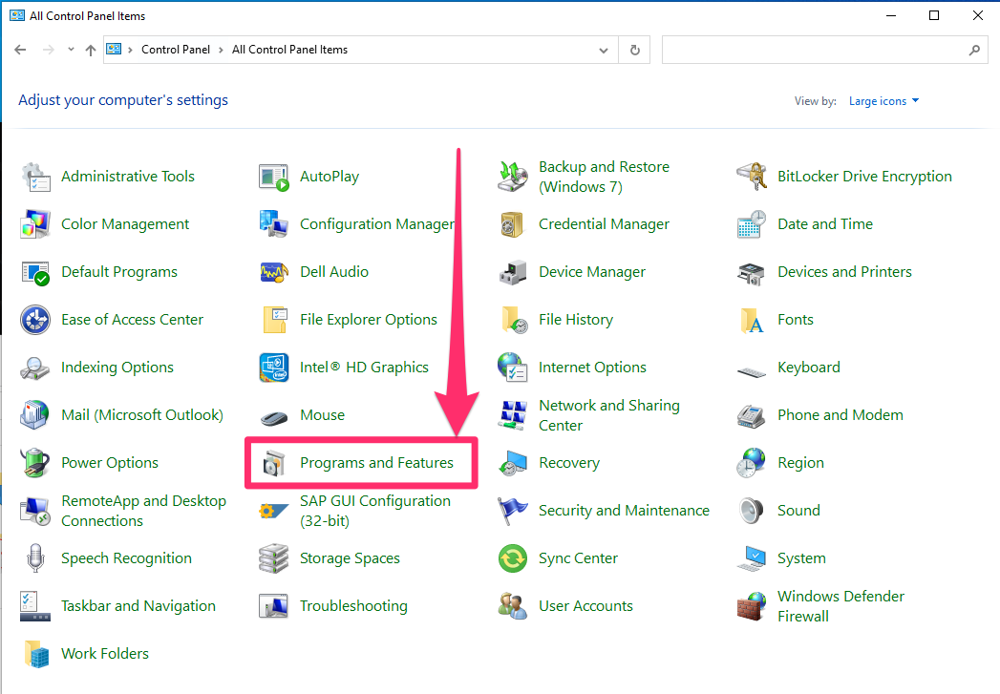

Installing a linux distribution on windows involves two main steps:

1.  Enabling the windows subsystem for linux (wsl) feature.
2.  Installing and setting up a linux distribution.

::: callout-note
Note: you will have to restart your computer after step 1.
:::

## Enabling Windows Subsystem for Linux

Windows Subsystem for Linux is a Windows feature that you'll need to turn on in the Control Panel.

#### 1. Launch Control Panel

You can find the Control Panel by searching "Control Panel" in the start bar.

#### 2. Go to "Programs and Features"

Inside control panel, click on *Programs and Features*.

<!-- I don't know why, but I have to link the imgage up a level -->



#### 3. Turn on Windows Features

Once inside Programs and Features, click on *Turn Windows Features On or Off* on the left hand side.


#### 4. Turn on WSL

A pop up window should appear. Scroll down to find "Windows Subsystem for Linux." Click the box so it is checked. Then press ok.


#### 5. Restart your computer

Your computer will need to restart before we continue the rest of the process. A window should open after hitting "OK" on the previous step asking if you want to restart now.

## Installing and Configuring a Linux Distribution

There are a few different linux distributions to choose from, but most online tutorials for WSL seem to assume you're installing Ubuntu, so I will also.

#### 1. Install Ubuntu

After your computer has restarted, launch the Windows Store, and search for "Ubuntu". On its store page, click on "Get" to install it.


#### 2. Launch Ubuntu

You can find Ubuntu, after it has been installed, but searching "Ubuntu" in the search bar. Launching it will open a [command line interface](/cli).

#### 3. Set a username

You will need to set a username for Ubuntu on your first launch. It doesn't have to be the same as your Windows username, but you might as well make it the same just to keep things easy. Just type in the username you want, and hit enter.

#### 4. Set a password

You'll also need to set a password for your Ubuntu account. Again, this doesn't *need* to be the same as your computer password.

::: callout-note
As you are typing in your password, you won't see the cursor move, or see blanked out characters like `*` like you are probably used to. That's just how password entry in command lines work, it's ok.
:::

You'll need re-enter your chosen password to confirm.

## Finding your files

In most command line interfaces, to get to your home directory, you type `cd ~`, which will still work in Windows Subsystem for Linux, but `~` isn't where your *Windows* files are. Instead, they're "mounted" at `/mnt/c/users/<USERNAME>` where `<USERNAME>` is your Windows username. If you're not sure what your Windows username is, inside Ubuntu type

``` bash
cd /mnt/c/users/
```

Then run `ls` to see the list of user directories. Yours should be in there.
